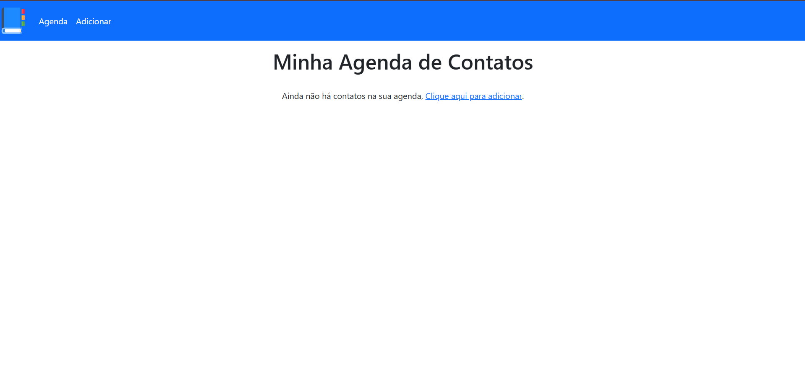
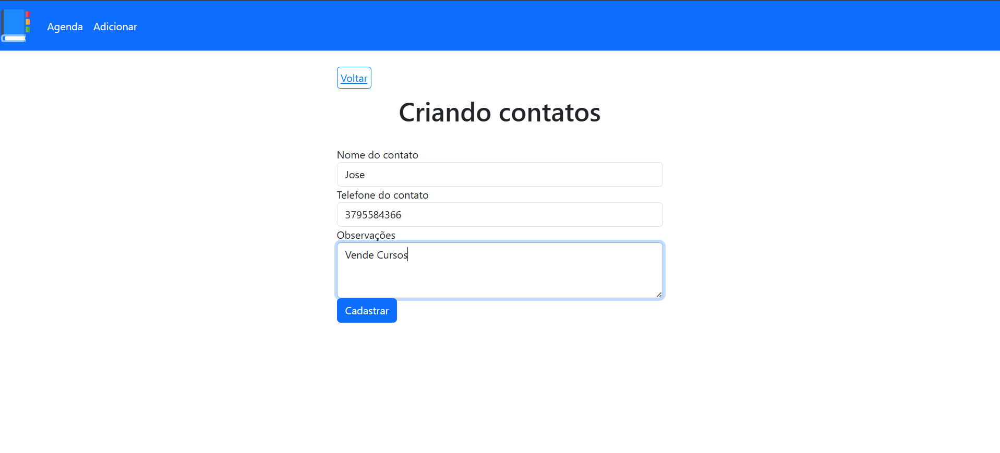
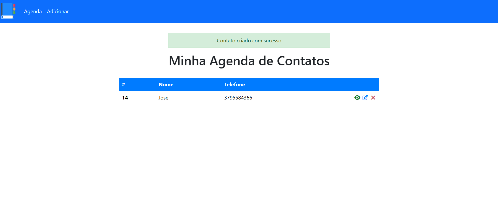
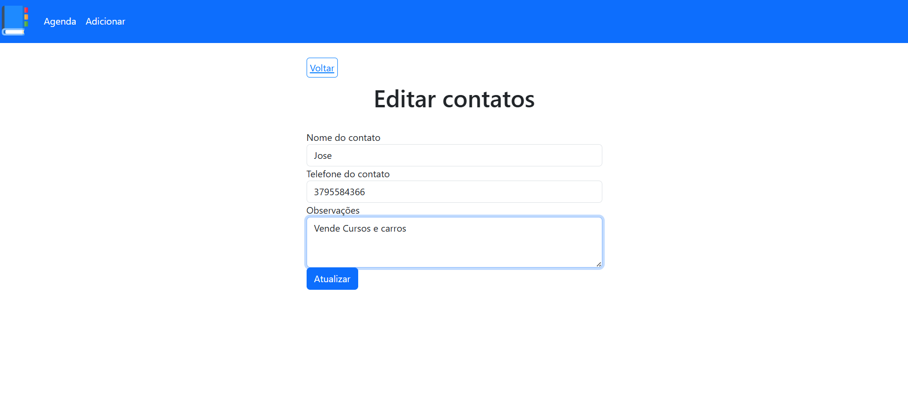
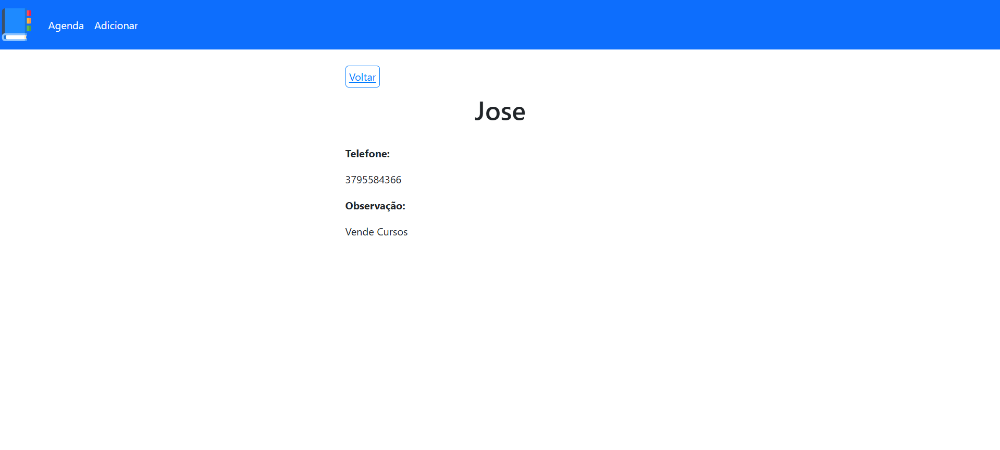
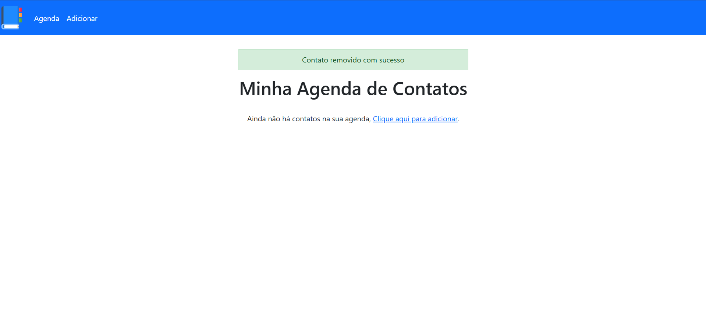

# Gerenciador de Contatos 📒

  
  
  
  
  

Aplicação web de **gerenciamento de contatos** desenvolvida com PHP, MySQL e Bootstrap. Criada durante o curso **Hora de Codar** da Udemy para praticar operações CRUD, integração com banco de dados e design responsivo.

---

## 📌 Sobre o Projeto
O projeto permite que o usuário gerencie seus contatos de forma eficiente: criar, visualizar, atualizar e excluir. Os dados são armazenados em um banco MySQL e a interface é responsiva graças ao Bootstrap.  

- Backend: PHP + MySQL  
- Frontend: HTML, CSS e Bootstrap  

---

## 🚀 Tecnologias Utilizadas
- **PHP** – lógica de backend  
- **MySQL** – banco de dados  
- **Bootstrap** – frontend responsivo  
- **HTML / CSS** – estrutura e estilo  

---

## ⚙️ Funcionalidades
- ✅ Criar novos contatos  
- ✅ Visualizar contatos existentes  
- ✅ Atualizar informações dos contatos  
- ✅ Excluir contatos  

---

## 🖼️ Demonstração com Imagens ou Vídeos

